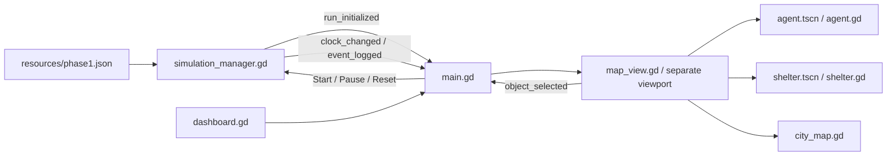

# Phase 1 scope, assumptions, and validation

> Historical Phase 1 delivery notes. Phase 2.5 now extends this prototype;
> current behavior and assumptions are in [PHASE_25_GUIDE.md](PHASE_25_GUIDE.md).

## Specifications inspected

The exact `(1).html` filenames were absent from the workspace. Equivalent files
were found and read at:

- `C:\Users\Moham\Downloads\Mondes-Vivants_Projet-5A-IABD.html`
- `C:\Users\Moham\Downloads\Directors_Plan_ESSAIM_Mondes_Vivants.html`

The exercise originally describes bee nest selection. The Director's Plan adapts
ESSAIM to civilians and authorities selecting nuclear shelters. Its shelter table
is the source of the capacities and qualitative resource/risk descriptions here.
The latest user prompt limits this delivery to the GDScript visual prototype.
It overrides the previous Python milestone task and the full academic roadmap.

## Modeling assumptions for this prototype

| Parameter | Current assumption | Where to edit |
| --- | --- | --- |
| Seed | 42; Reset reuses it | `resources/phase1.json` |
| Population | 20, including 4 authorities | same file |
| Speeds | Uniform 1.2–4.8 world units/second, stored only | same file |
| Traits | Independent uniform values in [0, 1] | same file |
| Time | Preparation elapsed time = frame delta × configured speed; default 1x | same file / manager |
| S5 existence | One Bernoulli draw with probability 0.5 at initialization | same file / manager |
| S1 supplies | 2,000 person-days = 1,000 people × 2 days | same file |
| Abundant supplies | Qualitative only; exact amount remains unspecified (`null`) | same file |
| S3 supplies | Explicit `Unknown` label, quantity `null`; no secret quantity sampled in Phase 1 | same file |
| Shelter locations | Visual placements; distance categories are labels, not calibrated metric distances | same file |
| Map | 1,800 × 1,080 world units; roads every 180 units | `scripts/city_map.gd` |
| Spawning | Seeded shuffle of distinct sidewalk slots; at least 65 units from shelter centers | map / manager |
| Zoom | 0.3–2.5; automatic fit within those limits | `scripts/map_view.gd` |
| Camera pan | 500 screen units/second, adjusted for zoom | same file |

There is no admission, resource consumption, maintenance failure probability,
survival model, or choice algorithm yet. Special risks are displayed as data.
The sidebar is an **operator view** of runtime truth, including S5 existence;
these records are not an agent knowledge model. Idle agents have no perception
or decision logic in this phase.

S5 and profiles use separate seeded `RandomNumberGenerator` instances. Changing
the number of agents does not alter S5's draw. Reproducibility assumes the same
configuration and Godot version. Godot does not promise identical RNG streams
across versions ([official RNG documentation](https://docs.godotengine.org/en/stable/classes/class_randomnumbergenerator.html)).

## Architecture

JSON is used for editable native Godot data. The reusable scenes are genuine
`.tscn` files; UI nodes and signals are created in code to avoid manual editor
setup. The separate map viewport keeps UI coordinates independent of camera
transforms. All graphics use built-in drawing methods and the built-in font.

Godot's GUI handles button events before map input, while the map uses its own
local viewport transform for picking
([official Control documentation](https://docs.godotengine.org/en/stable/classes/class_control.html)).

## Verification

Validated with **Godot 4.7.2 stable**, using its real executable:

- Headless editor import/parsing and main-scene startup.
- Standalone GDScript integration suite. It checks data and rendered node counts,
  all agent properties, unique valid positions, S3's unknown supplies, actual GUI
  clicks and inspector updates, selection highlights, mouse-wheel zoom, D-key
  pan, zoom bounds, clock/pause/speed, and reproducible Reset.
- Seeds 0–11 cover both present and absent S5 and verify population-independent
  existence. This is a determinism check, not a statistical proof of 50% frequency.
- Graphical OpenGL startup and screenshot review at 1920×1080 and a 1024×720
  requested window size. Output is stored locally in ignored `outputs/`.

The tests dispatch mouse press **and release** events, including the wheel's
release event. The initial Reset test failure came from an incomplete synthetic
wheel gesture in the test driver; the completed gesture passes.

Headless commands follow Godot's
[official command-line guide](https://docs.godotengine.org/en/stable/tutorials/editor/command_line_tutorial.html).
Automated checks and screenshot review do not replace a user's manual F5 check
on their own display and preferred window size.

## Deferred features and next phase

Evacuation/pathfinding, nuclear impact, ten-day survival, Kafka, LLMs, advanced
decisions, incidents, experiment reports, and recorded replay are **not implemented**.
Reset is seeded reinitialization, not replay of a historical event stream.

The recommended next phase is a basic GDScript evacuation loop: randomized
300–600-second countdown, actual agent movement along valid routes, a simple
explicit shelter objective, and capacity-limited admission. Proceed only after
the owner approves the visual prototype; implement survival and external
integrations in subsequent phases.
