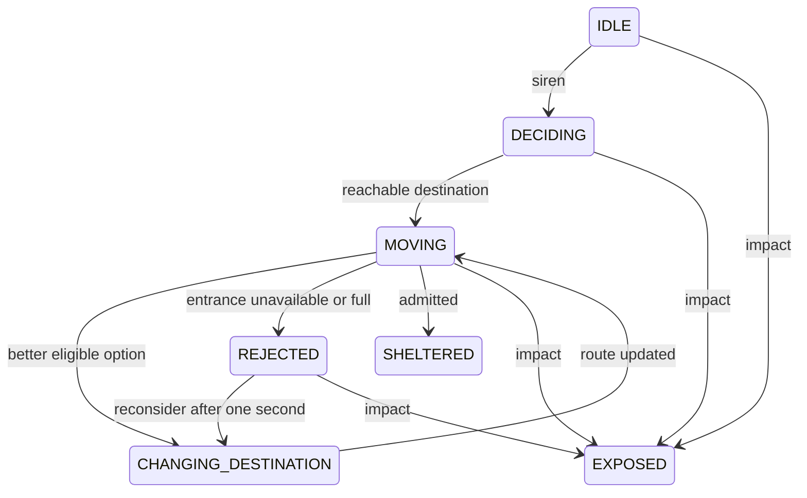

# ESSAIM Phase 2: nuclear evacuation

> Historical Phase 2 guide. The current project implements Phase 2.6;
> read [PHASE_26_GUIDE.md](PHASE_26_GUIDE.md) for the 3D city, Director camera,
> current controls and manual tests. Phase 2.5 cognition and incidents are preserved.

This extends the existing Godot project. Everything still runs in GDScript, with
no plugins, Python, API keys, or downloaded graphics/audio. It ends at impact:
**SHELTERED and EXPOSED describe location, not a final survival outcome.**

## Open and run

Open the existing `project.godot` in Godot 4 and press **F5**. Do not import a
new project or create/connect any nodes manually. Tested with Godot 4.7.2.

```powershell
Set-Location 'C:\Users\Moham\OneDrive\Desktop\ESSAIM'
$GodotExe = 'C:\Users\Moham\Downloads\godot\Godot_v4.7.2-stable_win64_console.exe'
& $GodotExe --path . --editor
# Alternatively, start the game without the editor:
& $GodotExe --path .
```

## What changed

The map, agent and shelter scenes, picking, camera, sidebar and journal from
Phase 1 remain. The preparation clock has become an evacuation clock. Start now
sounds a short generated warning tone, displays a countdown, and starts moving
agents. Occupancy cards, the live inspector, speed controls and impact summary
observe the same central run state.

| File | Responsibility |
| --- | --- |
| `scripts/simulation_manager.gd` | Initialization, fixed clock, states, decisions, arrivals, events and impact. |
| `scripts/scenario_config.gd` | Configuration validation extracted from the existing manager. |
| `scripts/evacuation_decisions.gd` | Scores shelter options using private beliefs. |
| `scripts/road_routes.gd` | Plans and follows simple routes on the drawn road grid. |
| `scripts/shelter_admission.gd` | Checks actual entrance eligibility and prevents duplicate admission. |
| `scripts/main.gd` | Existing dashboard plus live counters, controls and summary. |
| `scripts/object_inspector.gd` | Formats profiles, ETA, reasoning, scores and history. |
| `scripts/dashboard.gd` | Live occupancy cards and their shared styles. |
| `scripts/map_view.gd` | Existing camera/picking plus smooth actor updates and map impact overlay. |
| `scripts/agent.gd` | Existing agent scene, now colored by state. Authorities retain a cross. |
| `scripts/evacuation_effects.gd` | Synthesizes a three-second warning tone in memory. |
| `scripts/impact_effect.gd` | Brief map flash, expanding ring and impact tint; no damage logic. |
| `resources/phase1.json` | Existing configuration extended with evacuation settings and public shelter information. Its name is retained for compatibility. |
| `tests/test_phase2.gd` | Evacuation, boundary and UI tests. |
| `tests/test_phase1.gd` | Existing regression tests updated for the new Start behavior. |
| `tests/render_phase2.gd` | Captures real preparation, evacuation and impact screens. |

The reusable `.tscn` files and project main scene did not need replacement.
The independent Python scaffold remains unused.

## Countdown, Pause, Resume and speed

Initialization makes one seeded integer draw between **300 and 600 seconds**.
It is stored but hidden during preparation. Start reveals that value and triggers
one siren event. Resume reuses the remaining time and does not sound a new siren.

The central clock accumulates `real_delta × selected_speed`. For every accumulated
0.1 simulated seconds, it updates decisions, movement and admissions. No elapsed
time is discarded. This makes outcomes independent of rendering frame partitions,
subject to floating-point tolerance. Rendering interpolates positions between
steps; it does not move the authoritative agent data itself.

- **Start** begins evacuation. While paused, this button reads **Resume**.
- **Pause** freezes the countdown, movement and decisions. Camera and inspection
  remain usable; the warning tone pauses too if it is still playing.
- The speed dropdown supports **1x, 2x, 5x and 10x**. All evacuation time and
  movement use that speed. At 10x, the five-to-ten-minute evacuation lasts about
  30–60 real seconds.
- **Reset** restores preparation, initial profiles/positions, S5 existence and
  countdown using the current run's seed. It clears the summary, effect and log.
- Enter a seed next to **New run** to initialize that seed. If it equals the
  current seed, New run increments it; use Reset to repeat the same seed.

After impact, Start/Resume and Pause are disabled. Reset and New run still work.
The speed resets to the configured initial value when a run is initialized.

Countdown display rounds remaining time upward, so `00:00` means impact has
actually occurred. Event timestamps are recorded at fixed-step boundaries and
displayed as minutes and seconds. The final step is shortened when needed; it
cannot run past the deadline. Arrivals reaching the entrance exactly at the
deadline are processed immediately **before** the impact closes admissions.

## How agents decide

Each agent gets a personality, risk tolerance, trust in authority, sociability,
speed, and a separate dictionary of shelter beliefs. Actual `exists`,
`operational`, and current occupancy values are not passed to the decision code.

Published capacity, position, resource scores, popularity, known risks and
official support are initial information. S5 has a **50% existence belief** even
when absent. S3's supplies stay explicitly **Unknown**; each agent makes a noisy
resource estimate, without receiving a secret quantity. Initial occupancy is
only an estimate of zero. An agent learns that an entrance is full/unavailable
when personally rejected there; neighbors are not informed automatically.

Each shelter receives a score. Options are ineligible if believed unavailable,
believed full, believed nonexistent, or not reachable in the remaining time.
For eligible options, the default score is:

```text
  2.0 × resource score
+ 0.8 × estimated remaining places / 5000
+ 1.4 × sociability × social personality factor × popularity
+ 1.3 × trust in authority × official support
- 3.0 × travel personality factor × estimated travel seconds / seconds left
- 4.0 × (1 − risk tolerance) × risk personality factor × known risk
- 2.0 × (1 − risk tolerance) × (1 − existence belief)
- 1.0 × (1 − risk tolerance) × (1 − information confidence)
```

The best eligible score wins. An exact tie follows the configuration's shelter
order. Cautious personalities multiply the risk penalty by 1.5; Bold uses 0.6;
Social multiplies popularity influence by 1.6; Pragmatic multiplies the travel
penalty by 1.4. All other factors are 1.0. These multipliers are code-level
modeling assumptions in `evacuation_decisions.gd`; the score weights are editable
data. Different traits can change a ranking without random destination selection.

Agents reconsider every five simulated seconds, and after rejection. A moving
agent changes only if its current option is no longer eligible or the new score
beats it by the configured 0.15 margin. This reduces repeated destination flips.
If no reachable option remains, the agent waits and becomes EXPOSED at impact.
The full per-shelter scores, reasons, time and destination are retained in each
agent's decision history; the inspector shows the latest scores and eight recent
destinations. No new evacuation decision is allowed after impact.

## Movement and arrival

One map unit is one world unit. Speeds remain **1.2–4.8 world units per simulated
second**, so a 600-unit route takes 125–500 seconds, depending on the agent.
The map is a prototype coordinate system, not a geographically calibrated city.

Routes reuse the existing roads, spaced 180 units apart. An agent joins a nearby
intersection via its sidewalk, follows horizontal/vertical road segments, and
approaches the entrance. It spends exactly `speed × simulated time` across the
waypoints and never jumps over the remaining distance. Sheltered agents stop.

Route planning runs at decision intervals, not on every rendered frame. This is
simple grid routing, not obstacle-aware A*, congestion, or crowd collision.
Shelter positions must be within 30 units of a road centerline. The validator
enforces this, and tests check default routes against the buildings. A general
navigation system and calibrated geographic distances are future improvements.

## Admission and state transitions

At an entrance, admission checks the phase, duplicate status, existence,
operational status, and remaining capacity. The occupancy and occupant IDs are
updated together, and the agent becomes SHELTERED. Capacities are never exceeded.
Earlier arrivals within a tick are processed first; exact-time ties use a seeded
per-agent priority. A rejected agent observes the reason locally, waits one
simulated second, and selects another known reachable option if one exists.



DECIDING and CHANGING_DESTINATION are immediate transitions recorded in state
history; they may be too brief to see. REJECTED is gold, MOVING blue, SHELTERED
green, and EXPOSED red. At impact, every agent is SHELTERED or EXPOSED, admissions
close, movement stops, and the totals account for all 20 people. No agent is
assigned a death or survival probability.

## Editable assumptions

The existing JSON now includes an `evacuation` object. It controls countdown
bounds, fixed step, decision interval, rejection wait, switching margin, unknown
resource estimate variation, personalities and score weights.

Default shelter public values, all on [0, 1]:

| Shelter | Resource score | Known risk | Popularity | Official support | Confidence |
| --- | ---: | ---: | ---: | ---: | ---: |
| S1 | 0.08 | 0.05 | 1.00 | 0.80 | 0.90 |
| S2 | 1.00 | 0.35 | 0.70 | 0.50 | 0.85 |
| S3 | 0.50 ± 0.20 per agent | 0.10 | 0.45 | 1.00 | 0.40 |
| S4 | 1.00 | 0.04 | 0.15 | 0.70 | 0.90 |
| S5 | 1.00 | 0.04 | 0.05 | 0.20 | 0.50 |

These are documented **heuristics**, not measured probabilities of survival or
failure. S1's resource score is its 2,000 person-days divided by 2,500 capacity
and a ten-day benchmark: 0.08. That benchmark does not simulate ten-day survival.
If you edit supply quantities, also revise the explicit public resource score.
Abundant and Unknown quantities remain `null`, not zero. S2's risk affects
decisions but does not randomly break a shelter in Phase 2. `operational` is
editable initial world state; `public_existence_probability` is separate from
the actual seeded existence draw.

S5, profiles, countdown and beliefs use separate random streams, respectively
seeded with `seed`, `seed + 1009`, `seed + 2027`, and `seed + 3037`. Keep the same
Godot version and settings for repeatability. RNG streams may change between
Godot versions ([official documentation](https://docs.godotengine.org/en/stable/classes/class_randomnumbergenerator.html)).

## Manual testing

1. Press F5. Confirm preparation, 20 agents, five cards and zero occupancy.
2. Start. Check the warning tone, EVACUATION label, 05:00–10:00 initial countdown,
   and visible blue moving agents. Select one to inspect its reasoning and ETA.
3. Pause. Wait a few real seconds. Confirm positions and countdown do not change.
4. Resume. Change speed to 2x, then 5x and 10x; both movement and countdown speed up.
5. Select a shelter. Watch occupancy, percentage and remaining places update.
6. Let the clock reach zero. Check the flash/ring, IMPACT summary, closed
   admissions, stopped agents, and `sheltered + exposed = 20`.
7. Reset. Check original positions, zero occupancy, idle agents, cleared impact,
   and the same countdown when Start is pressed again.
8. Click New run. Confirm the seed changes. Reset repeats this new seed.
9. Test selection, pan, wheel zoom, Fit map and smaller-window/sidebar scrolling.

With the default capacities, 20 agents cannot fill a shelter. For a rejection
demonstration, **back up `resources/phase1.json` first**, then stop the game and
temporarily set each shelter's `capacity` to `1`. Leave S5's probability at 0.5.
Press F5, Start and use 10x. The journal should show rejections, changed
destinations and exposed agents at impact. Restore the original file afterwards.
For an unavailable shelter, temporarily set S2's `operational` to `false`; its
initial public beliefs remain optimistic and rejection is discovered at arrival.

An absent S5 may attract no agents in a normal run. The automated scenario tests
explicitly exercise arrival at absent S5. The sidebar shows actual existence to
the operator; the agent policy does not use that truth.

## Automated tests and validation

```powershell
& $GodotExe --headless --path . --editor --quit
& $GodotExe --headless --path . --script res://tests/test_phase1.gd
& $GodotExe --headless --path . --script res://tests/test_phase2.gd

# Render three real screenshots into outputs/:
& $GodotExe --path . --resolution 1920x1080 --script res://tests/render_phase2.gd

# Capacity-one screenshot validation, without changing the JSON on disk:
& $GodotExe --path . --resolution 1920x1080 --script res://tests/render_phase2.gd -- stress
```

Both suites are dependency-free GDScript. Phase 2 tests cover seeded countdowns,
choices, personality effects, hidden-state isolation, route geometry, movement,
speed, Pause/Resume, Reset, frame partition invariance, full/absent/unavailable
rejection, rerouting, duplicate admission, deadline-boundary arrival, exposed
accounting, post-impact freeze, live controls, summary and effect reset.

Project import/startup and these suites were run with Godot 4.7.2. Graphical
screenshots were checked at 1920×1080 and 1024×720 using the local OpenGL renderer.
The default seed-42 run had a 318-second countdown and 20 sheltered / 0 exposed.
The temporary capacity-one seed-0 scenario had a 404-second countdown and
5 sheltered / 15 exposed, with rejections and rerouting recorded. The screenshot
validation changes capacities only in memory and does not edit your JSON.
Audible playback must
also be checked on your own audio device. Tests verify the generated stream and
signal wiring but cannot establish what your speakers sound like.

The routing API is native Godot data and vector math; a future general graph
planner can use [Godot AStar2D](https://docs.godotengine.org/en/stable/classes/class_astar2d.html).

## Reporting bugs and future work

Send the exact Output/Debugger error, script path and line, Godot version, seed,
configuration edits, speed setting, and steps immediately before the problem.
For an incorrect admission, include the agent's ID and shelter. For layout
problems, include window size and a screenshot.

Phase 3 will address ten-day resource consumption and survival outcomes.
Kafka, LLMs, complex communication and advanced Storyteller incidents remain
unimplemented. Phase 2 logs are in-memory; recorded replay is still future work.
